# ArkOS-Loading-Screens
A collection of loading screens for ArkOS. This collection includes both images and ASCII loading screens.

## Loading Screens

### JPEG

The following table shows a sample of the loading screen images included in the collection.

|                                       |                                       |                                       |                                       |
|:-------------------------------------:|:-------------------------------------:|:-------------------------------------:|:-------------------------------------:|
| arcade-classic-hotpink.jpg            | arcade-classic-red.jpg                | arcade-neon.jpg                       | cartriages.jpg                        |
| 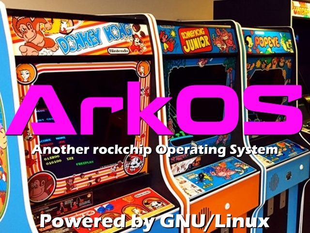 | 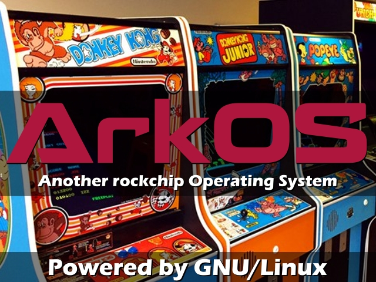 | 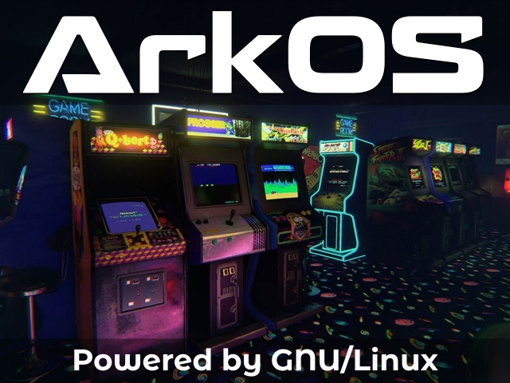 | 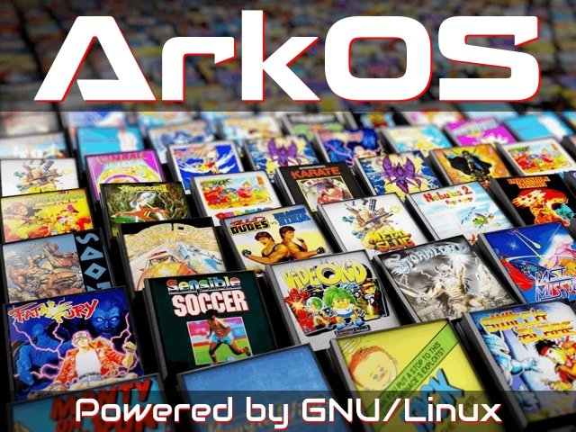 |
| collage.jpg                            | controllers.jpg                      | doom.jpg                              | earthworm-jim.jpg                     |
| 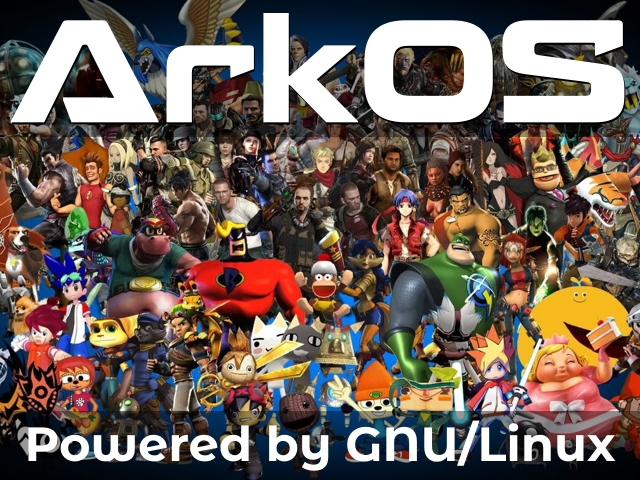 | 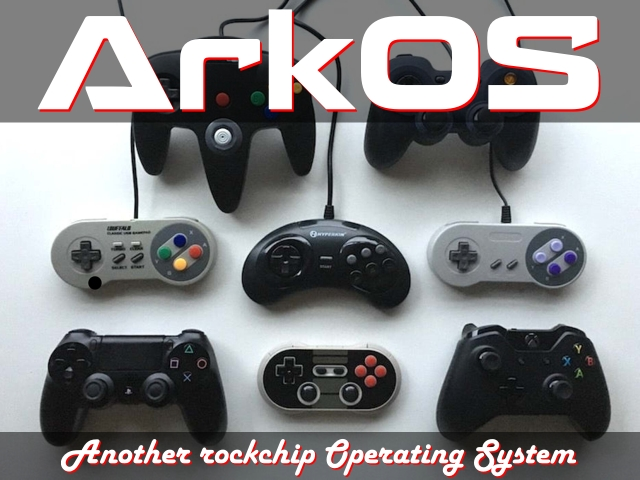 | 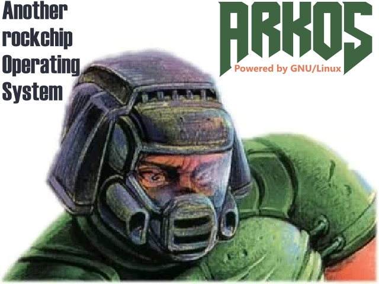 | 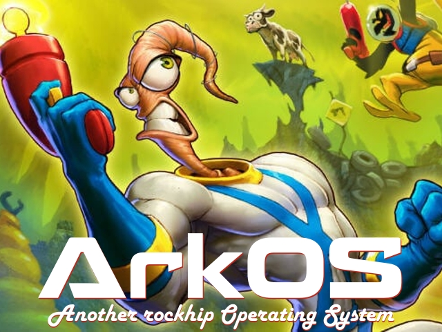  |
| game-boxes.jpg                         | keen.jpg                             | mario-oldschool.jpg                   | montage.jpg                           |
| 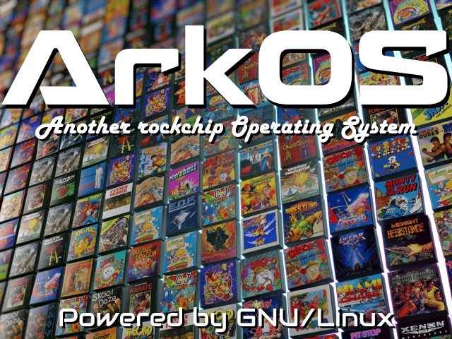 |  | 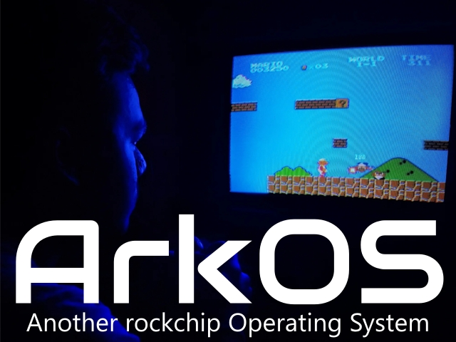 | 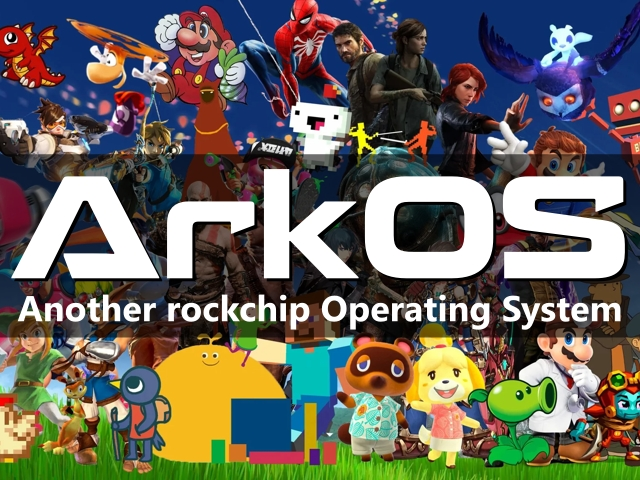 |
| surprised-pika.jpg                                                             | | | |
| 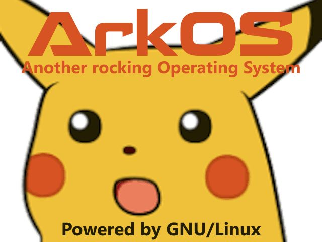 | | | |

### ASCII

The following table shows a sample of the loading screen ASCII included in the collection.

|                                       |                                       |                                       |                                       |
|:-------------------------------------:|:-------------------------------------:|:-------------------------------------:|:-------------------------------------:|
| calvin.ascii                          | dopefish.ascii                        | joystick.ascii                        | mario-head-t0b10.ascii                |
| 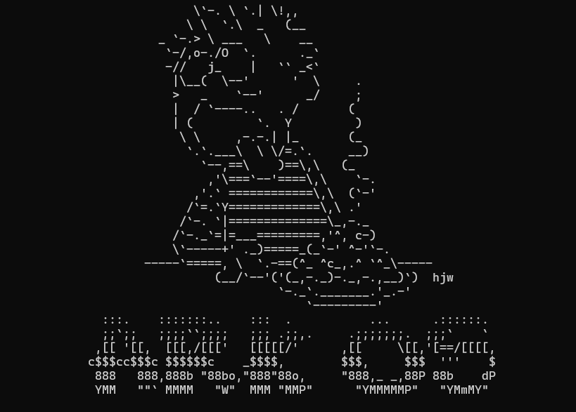 | 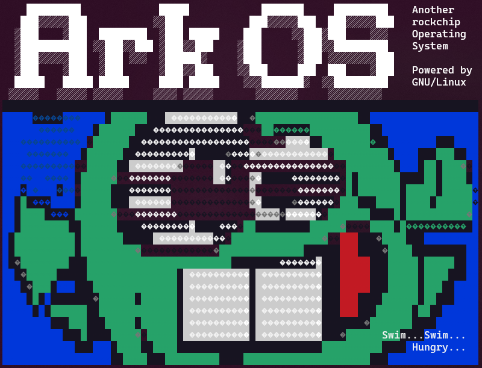 | 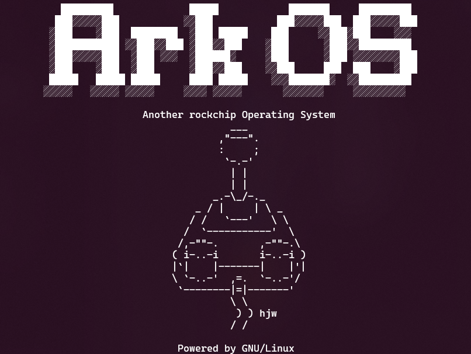 | 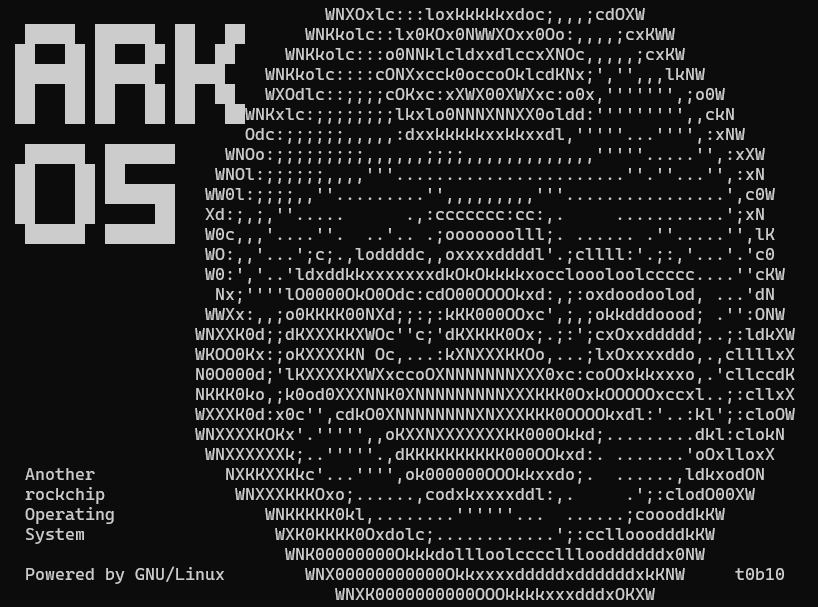 |
| mario.ascii                           | mushroom.ascii                        | pikachu.ascii                         | spongebob.ascii                       |
| 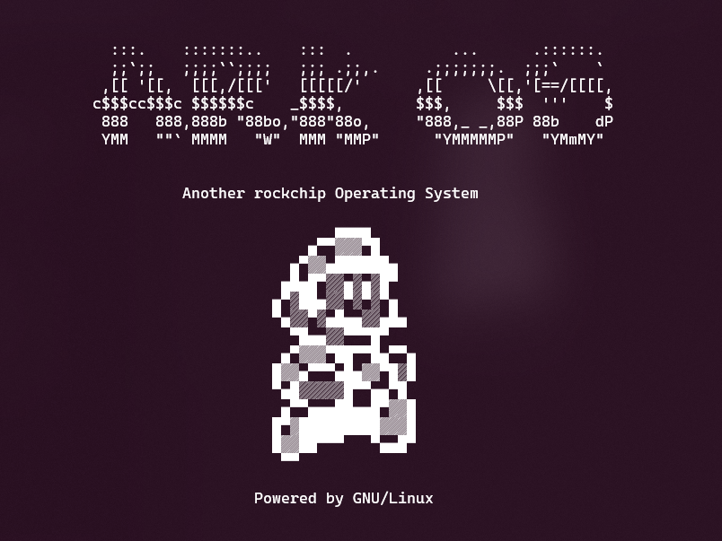 | 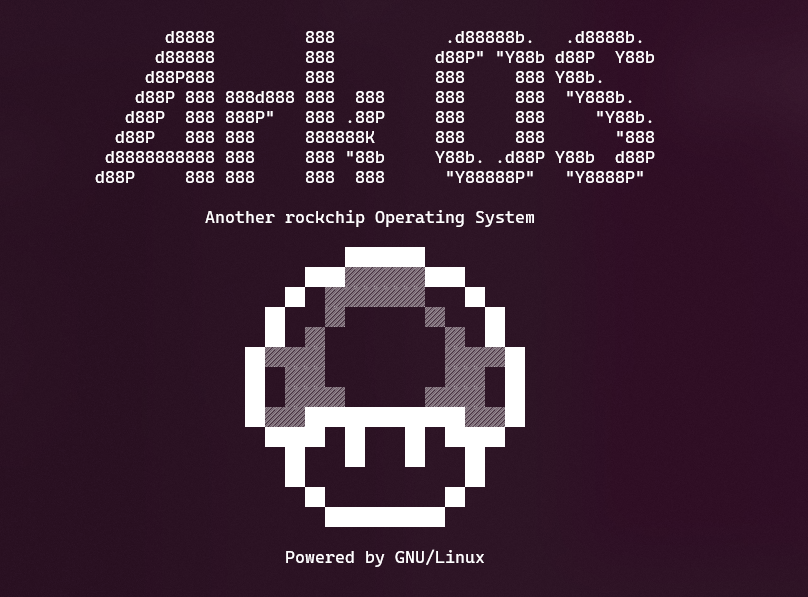 | 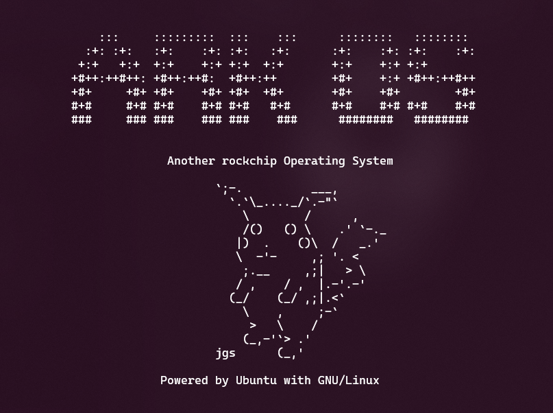 | 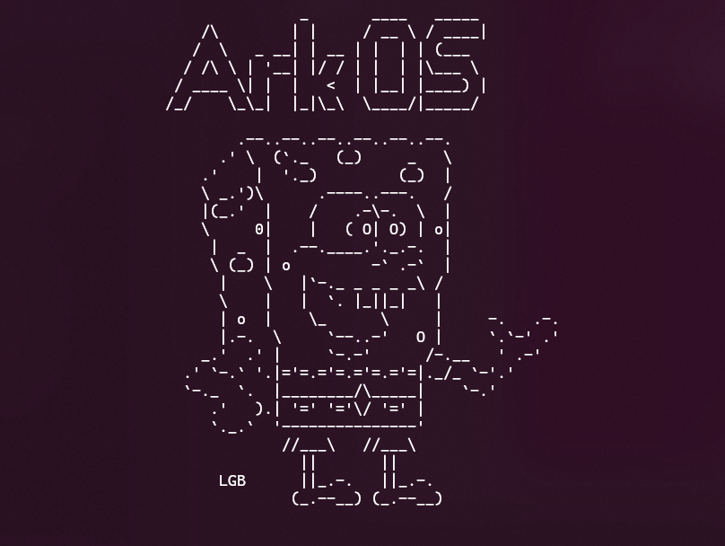 |
| toad.ascii                                           | | | |
| 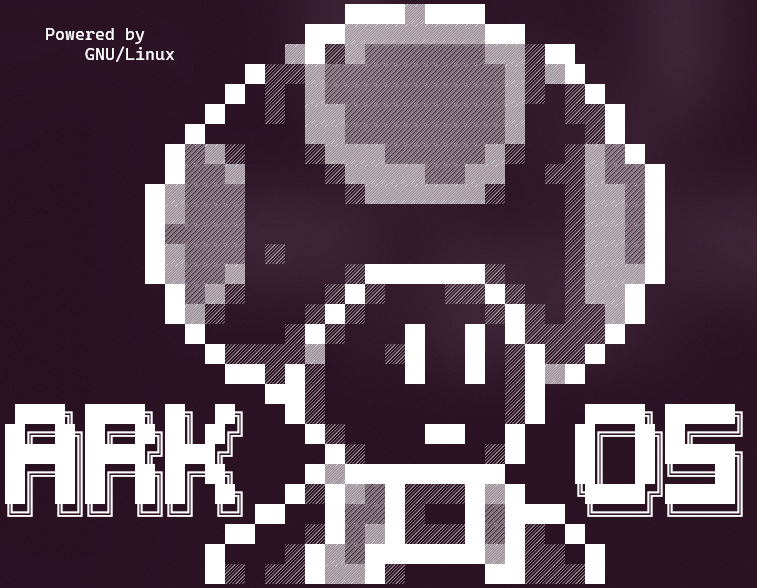 | | | |

## Contributions
Contributions are welcome. If you've created some loading screens you'd like to contribute, please submit a pull request.

## Coming Soon
I have written a script that can randomize your loading screen between game launches. I am still testing this and working out some of the kinks but check back soon for the script.

## Acknowledgements
Thanks to [Christian Hatian](https://github.com/christianhaitian) for creating [ArkOS](https://github.com/christianhaitian/arkos) and sharing it with the community. Please consider [donating to ArkOS](https://www.paypal.com/donate?hosted_button_id=RC72LJ4SSERSU) so that this awesome project can continue.